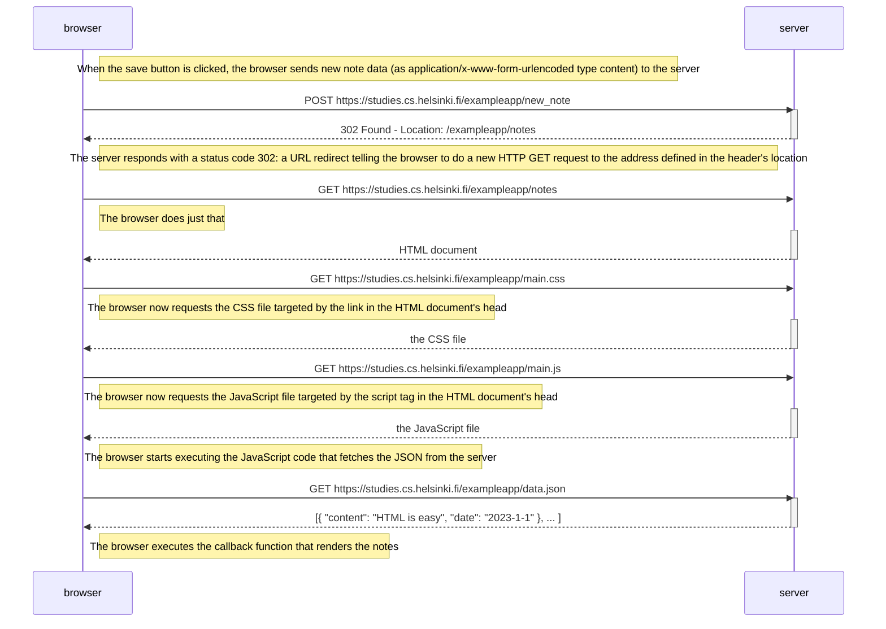

```mermaid
sequenceDiagram
    participant browser
    participant server

    Note right of browser: When the save button is clicked, the browser sends new note data (as application/x-www-form-urlencoded type content) to the server

    browser->>server: POST https://studies.cs.helsinki.fi/exampleapp/new_note

    activate server
    server-->>browser: 302 Found - Location: /exampleapp/notes
    deactivate server

    Note left of server: The server responds with a status code 302: a URL redirect telling the browser to do a new HTTP GET request to the address defined in the header's location

    browser->>server: GET https://studies.cs.helsinki.fi/exampleapp/notes
    Note right of browser: The browser does just that

    activate server
    server-->>browser: HTML document
    deactivate server

    browser->>server: GET https://studies.cs.helsinki.fi/exampleapp/main.css

    Note right of browser: The browser now requests the CSS file targeted by the link in the HTML document's head

    activate server
    server-->>browser: the CSS file
    deactivate server

    browser->>server: GET https://studies.cs.helsinki.fi/exampleapp/main.js

    Note right of browser: The browser now requests the JavaScript file targeted by the script tag in the HTML document's head

    activate server
    server-->>browser: the JavaScript file
    deactivate server

    Note right of browser: The browser starts executing the JavaScript code that fetches the JSON from the server

    browser->>server: GET https://studies.cs.helsinki.fi/exampleapp/data.json
    activate server
    server-->>browser: [{ "content": "HTML is easy", "date": "2023-1-1" }, ... ]
    deactivate server

    Note right of browser: The browser executes the callback function that renders the notes
```