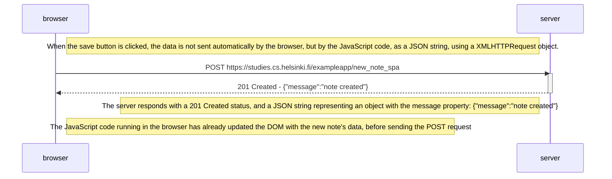

```mermaid
sequenceDiagram
    participant browser
    participant server

    Note right of browser: When the save button is clicked, the data is not sent automatically by the browser, but by the JavaScript code, as a JSON string, using a XMLHTTPRequest object.

    browser->>server: POST https://studies.cs.helsinki.fi/exampleapp/new_note_spa

    activate server
    server-->>browser: 201 Created - {"message":"note created"}
    deactivate server

    Note left of server: The server responds with a 201 Created status, and a JSON string representing an object with the message property: {"message":"note created"}

    Note right of browser: The JavaScript code running in the browser has already updated the DOM with the new note's data, before sending the POST request
```